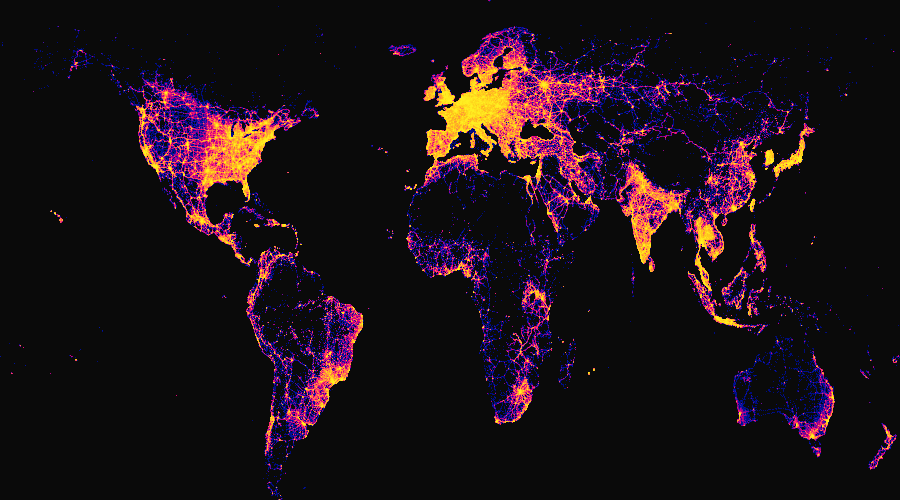
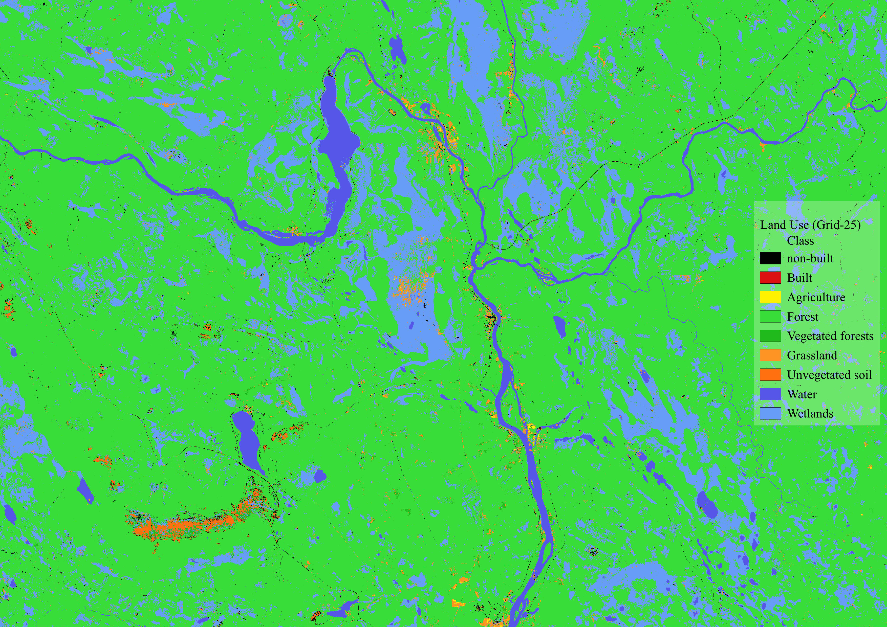

# Geospatial Analysis with High-performance computing (HPC)

This course is under development by the *GIS Science for Sustainable Transitions (GIST) Lab* at Aalto University. The HPC available is provided by the IT Center of Science (CSC). 

# Lessons

## 1. Cell Tower aggregation by country worldwide
This lesson is focused in using Parallel Computing resources using Dask-Geopandas.
By using a global dataset of Cell Tower's locations we will attribute the country to every tower using Spatial Join (Overlay) and estimating the performance of the parallel computing and and single-core computing.

##### Open the lesson here 👉 [Lesson1-Notebook](source/lessons/L1/01_CellularTowers-Parallelization.ipynb)

The result:

## 2. Shortest Path analysis in the Helsinki Region - Home to city center
This lesson is focused in computing the Shortest Path (parallel in 16 cores) from every available OSM residential buildings in the Helsinki Region to Rautatieasema. The notebook contain a step-by-step guide of the Shortest Path process using the available cores mainly in *Finding the closest nodes*, *Computing the Shortest Path*, and *From nodes to path creation*.

##### Open the lesson here 👉 [Lesson2-Notebook](source/lessons/L2/02_ShortestPath-Parallelization.ipynb)

The result:

## 3. Land cover classification using Random Forest - Lapland
This lesson is focused in processing point data and Earth Observation (EO) layers in regions of Finland. The case example is processed in Lapland province. This exercise was developed in cooperation with SYKE and their tool **pointEO** that made the process handy.

##### Open the lesson here 👉 [Lesson3-Notebook](source/lessons/L3/03_LandCoverClassification_syke_Parallelization.ipynb)

The result:

# Attribution

**GIST (2023)**. Geospatial Analysis with High-performance Computers using Core-parallelization. Aalto University. Website [gistlab.science](gistlab.science)

# Contact
Please, contact the personnel on charge if you have questions about this material:

#### - Professors: [Henrikki Tenkanen](https://gistlab.science/rushmore_teams/henrikki-tenkanen/) & [Jussi Nikander](https://gistlab.science/rushmore_teams/jussi-nikander/)

#### - Developer: [Bryan Vallejo](https://gistlab.science/rushmore_teams/msc-bryan-vallejo/)