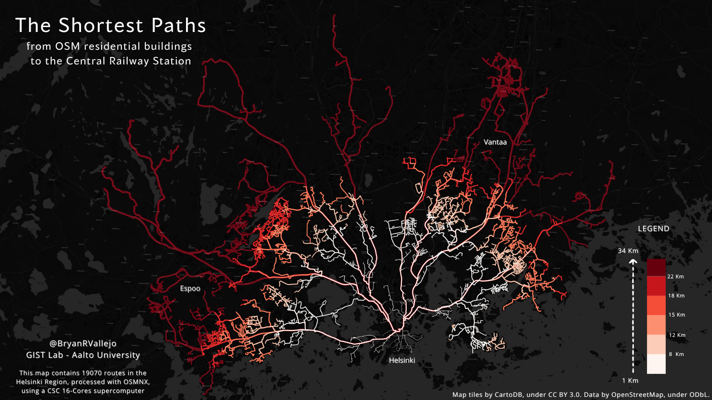

# Geospatial Analysis with High-performance computing (HPC)

This course is under development by the *GIS Science for Sustainable Transitions (GIST) Lab* at Aalto University. The HPC available is provided by the IT Center of Science (CSC). 

# Lessons

## 1. Shortest Path analysis in the Helsinki Region - Home to city center
This lesson is focused in computing the Shortest Path (parallel in 16 cores) from every available OSM residential buildings in the Helsinki Region to Rautatieasema. The notebook contain a step-by-step guide of the Shortest Path process using the available cores mainly in *Finding the closest nodes*, *Computing the Shortest Path*, and *From nodes to path creation*.

##### Open the lesson here 👉 [Lesson1-Notebook](source/lessons/L1/01_ShortestPath-Parallel-16cores.ipynb)

The result:

<!-- 
# Development-test

You can find an example developed for testing the Parallel processing performance with a long processing time example.

## Shortest Path analysis in the Helsinki Region (Long run)

The advantage in processing time using parallelization:

- **16 Core:** 10.56 mins
- **1 Core:** 90.44 mins

##### Open the example here 👉 [Long run-Notebook](source/lessons/test/01_ShortestPath-LongRun-16cores.ipynb)

The result:

 -->

# Attribution

**GIST (2023)**. Geospatial Analysis with High-performance Computers using Core-parallelization. Aalto University. Website [gistlab.science](gistlab.science)

# Contact
Please, contact the personnel on charge if you have questions about this material:

#### - Professors: [Henrikki Tenkanen](https://gistlab.science/rushmore_teams/henrikki-tenkanen/) & [Jussi Nikander](https://gistlab.science/rushmore_teams/jussi-nikander/)

#### - Developer: [Bryan Vallejo](https://gistlab.science/rushmore_teams/msc-bryan-vallejo/)