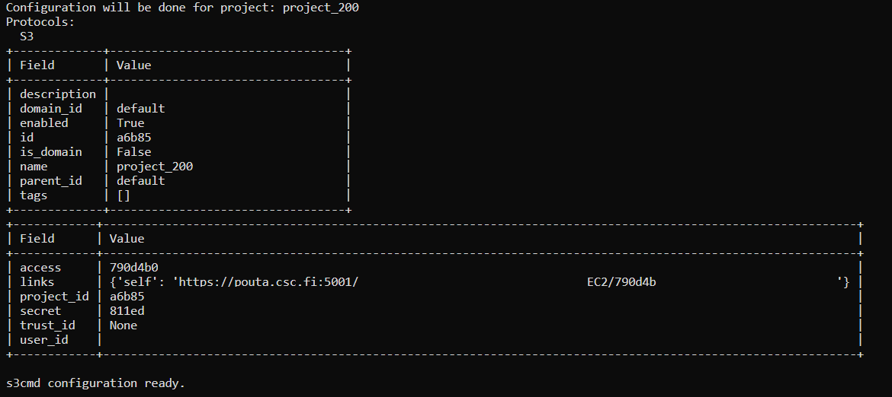

Manage Allas with Python
===========================

Allas is a CSC storage service that can be accessed from supercomputers or local laptop/PC/. 
Allas storage is allocated by specific project_200xxxx and it can be active while the project is active.

Data files are stored in Buckets (container) and can be accessed with protocol Swift or S3. If you want to know more about Allas take a look the `Allas documentation <https://docs.csc.fi/data/Allas/introduction/>`_. 

To access our data in Allas with the S3 Protocol we will first configure Allas and S3 and then we will use it in our notebook. If you want to know more about S3 in Allas find examples in the 
`CSC's S3 connection in Allas <https://docs.csc.fi/data/Allas/using_allas/python_boto3/>`_. 

Start accessing your Terminal in your project_200xxxx directory in Puhti or directly using Jupter Lab's terminal. Both options work.

Configure S3 and Allas (Puhti)
===============================

To configure S3 in your project first you have to add Allas module, type the next command.

.. code-block:: bash

    $ module load allas

You can confirm that Allas module is added using `module list`

Then, configure Allas using S3 protocol, using the next command.

.. code-block:: bash

    $ allas-conf --mode s3cmd

Afterwards, it will ask for your **CSC Password** and you will choose the project_200xxxx that you want to add connection. The success message looks like Figure 2.

    
    *Figure 1. Allas - S3 connection success*

Boto3 functions for Allas
================================

Read file from Allas
-----------------------

If you want to read data directly from your **Bucket** in Allas here is a sample code

.. code-block:: python

    import pandas as pd
    import boto3

    # create connection s3
    s3_client = boto3.client("s3", endpoint_url='https://a3s.fi')

    # define bucket name and object name
    bucket_name = "MyBucket"
    object_name = "MyFolder/MyFile.csv"

    # Read data to memory before opening with Pandas
    response = s3_client.get_object(Bucket=bucket_name, Key=object_name)

    # read
    df = pd.read_csv(response.get("Body"), sep=";")

    df.head()

Download file from Allas
------------------------------

If you want to download data from your **Bucket** in Allas to your local disk. Here a sample code.

.. code-block:: python

    import pandas as pd
    import boto3    

    # create connection s3
    s3_resource = boto3.resource('s3', endpoint_url='https://a3s.fi')

    # destination path
    destination_path = 'MyLocalDisk/MyLocalFolder/MyNewFile.csv'

    # --------------- Save to local

    # define bucket name and object name
    bucket_name = "MyBucket"
    object_name = "MyFolder/MyFile.csv"

    s3_resource.Object(bucket_name, object_name).download_file(destination_path)

    print(f'File saved in {destination_path}')

Upload file to Allas
-----------------------

If you want to upload files from local disk to your new **Bucket** here is a sample code

.. code-block:: python

    import pandas as pd
    import boto3 

    # create connection s3
    s3_resource = boto3.resource('s3', endpoint_url='https://a3s.fi')

    # --------------- Save to Allas

    # define bucket name and object name
    bucket_name = "MyNewBucket"
    object_name = "MyFolder/MyFile.csv"

    # create a new bucket
    s3_resource.create_bucket(Bucket=bucket_name)

    # source path
    source_path = 'MyLocalDisk/MyLocalFolder/MyLocalFile.csv'

    # send to new project
    s3_resource.Object(bucket_name, object_name).upload_file(source_path)

    # list uploaded files in Bucket
    my_bucket = s3_resource.Bucket(bucket_name)

    for my_bucket_object in my_bucket.objects.all():

        print(my_bucket_object.key)

