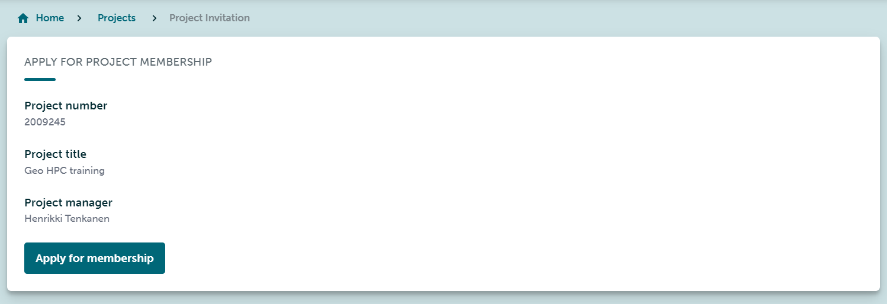
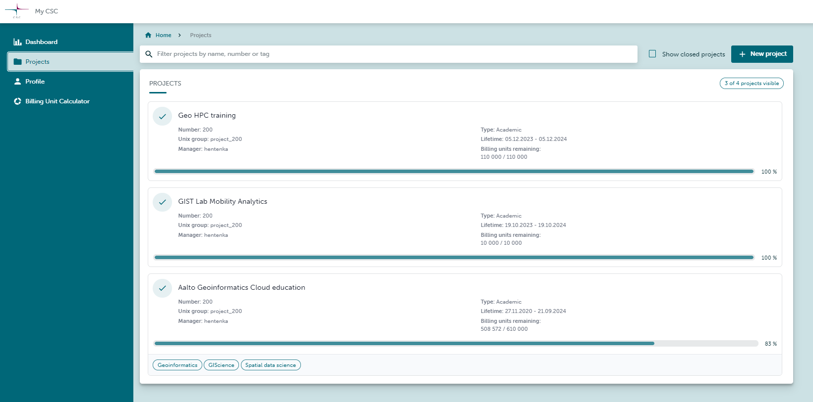
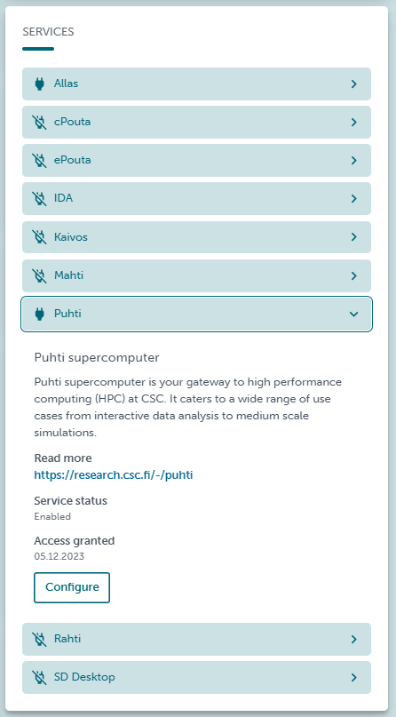

Activate CSC resources
=========================

To start using CSC computational resources you need to accept beforehand a **Project** in **My CSC**. 
Start logging in to My CSC.

.. admonition:: My CSC!

    To log in to My CSC you need a *CSC account* or *HAKA* credentials.

    .. button-link:: https://my.csc.fi/login
            :color: primary
            :shadow:
            :align: center

            👉 Log in to My CSC

Keep in mind that to having access to a project you will receive a invitation from a *Manager* that has rights to create a project and assign resources. 
You have to accept the invitation clicking in the button *Apply for a membership* and then you will have access the computational resources.

This is how an invtation looks like.

    
    *Figure 1. My CSC - Project invitation*

Then, in My CSC go to **Projects** section and you will find the projects that you are currently working. A Project is virtual space 
that gives you access to CSC computational HPC resources (cPouta, Puhti, Allas, and others) and displays the credits you have to use 
mentioned resources named *Billing Units*. The Projects are followed by its registration number and its name looks like **project_200xxxx**.

    
    *Figure 2. My CSC - Projects*

Open the project you want to use.

In the right side you will find the services that you can access. For example, the available resources in the next image are **Allas** and **Puhti** 
and they display a black switch. The other resources will be shown as unavailable and only *Manager* can grant access.

    
    *Figure 3. My CSC - Project services available*

Be sure that you have granted access to **Puhti** and **Allas** in your project. We will use them in the tutorials.