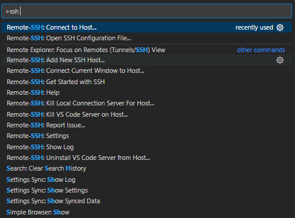
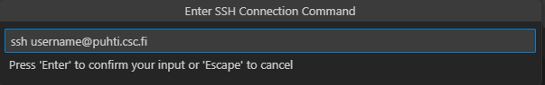
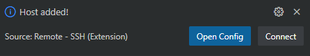
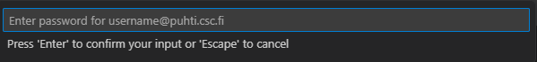
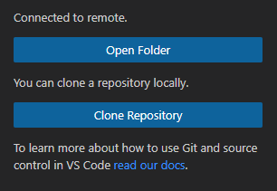

Access HPC from Desktop
=====================================

To connect to High-performance Computers (HPC) for scripting from your personal Desktop 
it is recommended to use an IDE (Integrated Development Environment).

VSCode and extensions
--------------------------------------------

Start installing an IDE for example the `VSCode <https://code.visualstudio.com/download/>`_ 

Then, install the extension `Remote - SSH <https://code.visualstudio.com/download/>`_ simply by clicking in the button **Install** and same when it opens VSCode. 
I recommend also installing the extension for `Jupyter <https://marketplace.visualstudio.com/items?itemName=ms-toolsai.jupyter>`_  

The *Remote SSH* extension will help you to connect to HPC resources from your personal desktop.

Access HPC resources
------------------------------------

A good keyboard command for VSCode that you should know is **Ctrl + Shift + p** that opens the functionalities of VSCode. 

Then, type **SSH** and click in the option **Connect to Host**.

Choose the option like in Figure 1.

    
    *Figure 1. Remote SSH - Connect to Host*

Then, select the option **Add New SSH Host**, and access using ssh key and your CSC username for Puhti. 

Like in Figure 2.

    
    *Figure 2. Remote SSH - SSH key and username*

If it asks about and **SSH configuration file** be sure you are choosing the one which is in your local disk like *C:\Users\username\.ssh\config*

Then, connect to your new added **SSH Host**. Like in Figure 3

    
    *Figure 3. Remote SSH - Connect to new Host*

Finally, it will ask you to type your **CSC account password**

Like Figure 4

    
    *Figure 4. Remote SSH - Type password*

Once you are in the HPC machine, in directory section, select the option **Open Folder**. Like in Figure 5. 

    
    *Figure 5. Remote SSH - Open directory*

Then, find your project in */projappl/project_200xxxx/* and press **OK**. Like Figure 6.

    
    *Figure 6. Remote SSH - Project in scratch disk*

Here you will be able to use the resources of the default disk partition. If you are willing to know more about the partitions find it in the 
`Puhti Partitions Documentation <https://docs.csc.fi/computing/running/batch-job-partitions/>`_.

Activate your environment
---------------------------

In order to run scripts simply activate your **customized environment** installed from the previous lesson `Install customized HPC environment <https://geohpc.readthedocs.io/en/latest/getting-started/install-env.html/>`_.:

.. code-block:: bash

    $ export PATH="/projappl/project_200xxxx/env_container/bin:$PATH"

You can monitor your resources opening **htop** directly from terminal.

To run scripts simply run like a normal Python script (example).

.. code-block:: bash

    $ python hello-hpc.py

Reserve an interactive session
--------------------------------

When you log in to the supercomputer you will be in a starting node which is shared by all users. 
The starting node is not intended for heavy computing instead you should use a reserved interactive session. 

An interactive session starts a computing node where user can request specific resources (time, memory, 
cores, disk). Find more information in the `Interactive Usage Documentation <https://docs.csc.fi/computing/running/interactive-usage/>`_.

In the starting node, type the next command line:

.. code-block:: bash

    $ sinteractive -i

Then, in terminal will be asked the resources you want for your computing node.

Be sure that you have activated your environment. Then, you can simply run scripts and your reserved computing resources.

