Customized HPC env
====================

For some analysis where you need more specialized libraries you can create you own environment. Here, you will find instructions about how to install 
a customized environment in CSC's Puhti supercomputer using a containerized approach.

.. note::

   The following assumes that you have access to CSC Finland's computing resources. In case you do not have access to CSC's resources,
   you can still install all the required Python libraries used in the lessons by installing the `environment.yml <https://github.com/AaltoGIS/GeoHPC/blob/master/env/environment.yml>`__
   using mamba/micromamba/miniconda package managers. If you are new to Python's package managers, you can `learn more from here <https://pythongis.org/part1/chapter-01/nb/06-installation.html>`__.

Log in to Puhti
------------------

The first step to start creating your own space for **High Performance Computing (HPC)** 
is to log in in the **CSC Puhti supercomputer**.

.. admonition:: CSC Puhti!

    To log in to the web interface of Puhti supercomputer you need a *CSC account* or *HAKA* credentials.

    .. button-link:: https://www.puhti.csc.fi/public/
            :color: primary
            :shadow:
            :align: center

            👉 Log in to Puhti

Directories overview
----------------------

You will find three different spaces in the Diretory. Each of them can be used in different needs due to its capacity.

- home with **10 GB capacity** for personal files
- projappl with **50 GB capacity** for intermediate processes
- scratch with **1 TB capacity** for big output

We will proceed using *projappl* to install our personal environment. Note! We will use *projappl* just in case the disk *scratch* is cleaned up. 
In this case you will not lose your environment and no need to install it again.

Create your personal folder
-----------------------------

Once you are logged in you will see the *User Interface* of Puhti that shows the Apps you can use with HPC (Figure 1). 
We are going to install a containerized Python environment in our **projappl** directory that later on will be connected to **Jupyter Lab**. 

Start opening the *Home Directory* icon and find the **projappl** Directory.

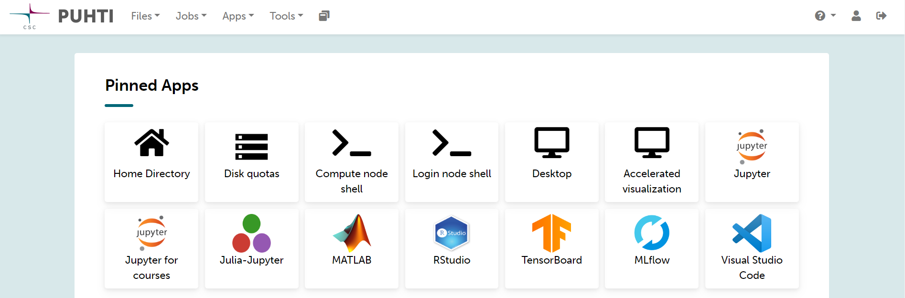
    
    *Figure 1. Puhti - User Interface*

Once you have opened the **projappl Directory**, in the left side, you will see the code of your project like *project_200xxxx* 
in two different Disk section like **projappl** and **scratch**. You should know that the scratch Disk must be used temporary 
because it has a regular clean up (every 180 days) meanwhile the projappl Disk has no clean up. In the projappl Disk 
the capacity is 50GiB and in the scratch Disk the capacity is 1TiB. You can read more about the 
Disk partition in `CSC Disk areas <https://docs.csc.fi/computing/disk/>`_. For the lesson, use **projappl**. 

Start creating a new folder called **GIT-HPC** (Figure 2).

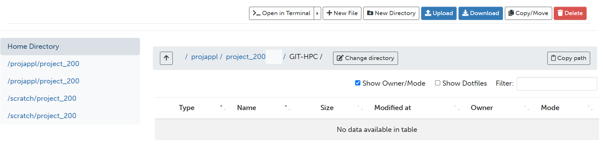
    
    *Figure 2. Puhti - projappl Directory personal set up*

Clone the repository
----------------------

Once you have your folder ready it is time to clone the repository with the needed material like the coding Notebooks and the **environment.yml** file 
that we will use to creating our environment. Take a look in the menu on top you have the option **>_ Open in Terminal** like in Figure 3.

Open your folder in terminal.

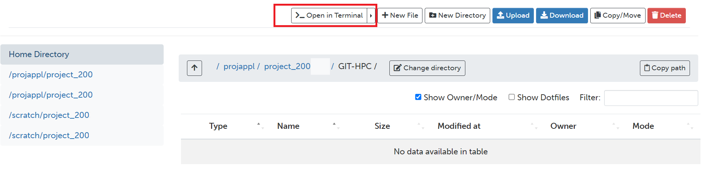
    
    *Figure 3. Puhti - Home Directory and Open in Terminal button*

Then, you will have a view of the terminal like in Figure 4. It will contain your new folder as a directory and your user log in.

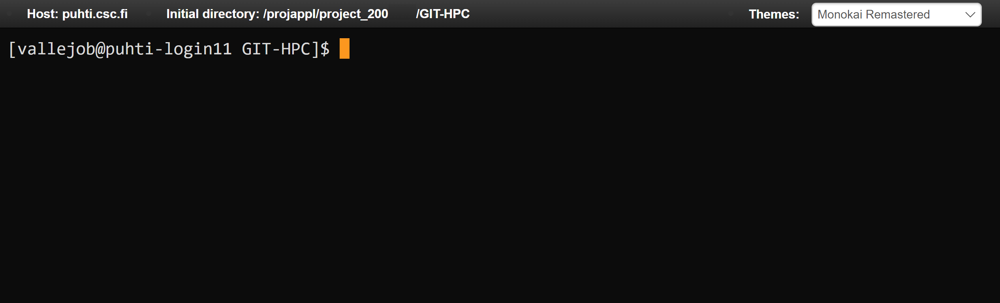
    
    *Figure 4. Puhti - Terminal*

We will clone the Repository in Puhti using **Git**. Copy and paste in your open terminal the next line (ommit the symbol $):

.. code-block:: bash

    $ git clone https://github.com/AaltoGIS/GeoHPC.git

It should be like in Figure 5.

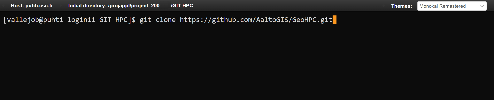
    
    *Figure 5. Puhti - Clone the repository using terminal*

You can also explore a bit the repository on GitHub here:

.. button-link:: https://github.com/AaltoGIS/GeoHPC
            :color: primary
            :shadow:
            :align: center

            👉 GeoHPC Repository

Once the Repository is cloned it should be abvailable in your Directory. You can check using the next command:

.. code-block:: bash

    $ ls

If you are willing to know more about Linux commands you can check in the `Linux commands from CSC documention <https://docs.csc.fi/support/tutorials/env-guide/using-linux-in-command-line/>`_.

Finally you can clear the terminal (optionally) using the command:

.. code-block:: bash

    $ clear

Enable *Tykky* module
-------------------------

The Tykky module is a container wrapper that helps to install software in HPC. It can be used to containerize a conda environment 
using an **environment.yml** file. We will activate the Tykky module and install a customized environment that we will use further 
with our notebooks.

Enable *Tykky* module:

.. code-block:: bash

    $ module add tykky

Be sure that you have added *Tykky* using **module list**, it will tell like in Figure 6.
    
.. code-block:: bash

    $ module list

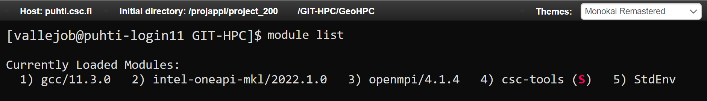
    
    *Figure 6. Puhti - Modules*

Containerize Python environment
---------------------------------

We will start creating a new folder called **env_container** where we will containerize our Python environment. Simply, 
use the terminal and the next command line:

.. code-block:: bash

    $ mkdir env_container

You will notice that now you have a new folder like in Figure 7.

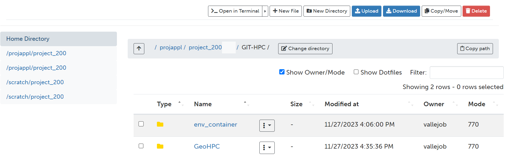
    
    *Figure 7. Puhti - A new folder for environment*

Now, we will containerize our environment using *tykky*. We need to specify two paths: 1) the directory 
where you will containerize the environment, and 2) the **environment.yml** file path.

The command we will use has the form *conda-containerize new --prefix {directory} {environment.yml}*

Our newly created folder **env_container** and the environment 
file is located in the folder **env** in our cloned repository. It is recommended to create 
the containerized environment outside the git folder *GeoHPC* so it is not compromised in case you need update 
or delete the folder then the environment is not compromised.

.. code-block:: bash

    $ conda-containerize new --mamba --prefix env_container GeoHPC/env/environment.yml

Alternative without mamba (might be slower):

.. code-block:: bash

    $ conda-containerize new --prefix env_container GeoHPC/env/environment.yml

Once the environment is installed you will see the message *Done*. This installation 
process might take approximately 15 minutes. Your terminal might give a message like in Figure 9.

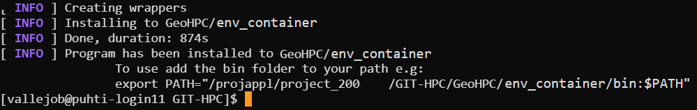
    
    *Figure 8. Puhti - Environment containerized using tykky*

If everything looks like this so far you have installed successfully a customized Python 
environment in HPC. In the next page you will learn how to use this environment with Jupyter Notebooks and HPC resources. 

Activate your environment (optional)
---------------------------------------

You can use the next command (be sure you replace 200xxxx with your project number) to activate your environment and run scripts:

.. code-block:: bash

    $ export PATH="/projappl/project_200xxxx/GIT-HPC/env_container/bin:$PATH"

Set up a Jupyter Notebook
===========================

To access the **JupyterLab** application you can simply navigate to the User Interface menu in the Puhti dashboard or
opening the **Apps** menu in the upper menu. If are logged in you can access to the dashboard using this link: 

.. admonition:: CSC Puhti dashboard!

    To access Puhti dashboard you need to log in with a *CSC account* or *HAKA* credentials.

    .. button-link:: https://www.puhti.csc.fi/pun/sys/dashboard
            :color: primary
            :shadow:
            :align: center

            👉 Puhti dashboard!

Simply, to start the **JupyterLab** click on the **Jupyter** button, like in Figure 9.

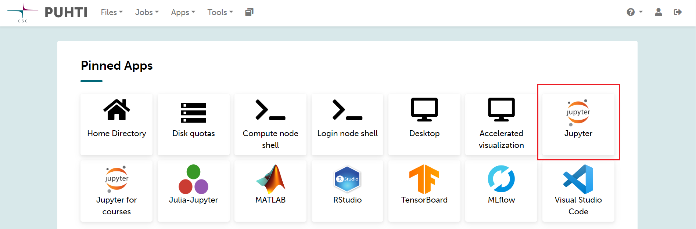
    
    *Figure 9. Puhti - Dashboard and Jupyter*

Then, you will see how the *Jupyter session* starts where you can set up the resources for your Jupyter Notebook.
Be sure you have selected your own **project** like *project_200xxxx*. In this case, we are using **partition** interactive which has maximum 8 cores 
which is enough for our need. If you are willing to know more about the partitions find it in the 
`Puhti Partitions Documentation <https://docs.csc.fi/computing/running/batch-job-partitions/>`_.

For our parameters we will reserve 8 cores, 32 GB of processing memory, 60 GB of local disk, and 2 hours of availability, as an example.
Your resources for now should look like Figure 10. Be sure that you are using your resources personally. 

.. note::

   If more people is sharing resources this configuration is not optimal and you must decrease resources.

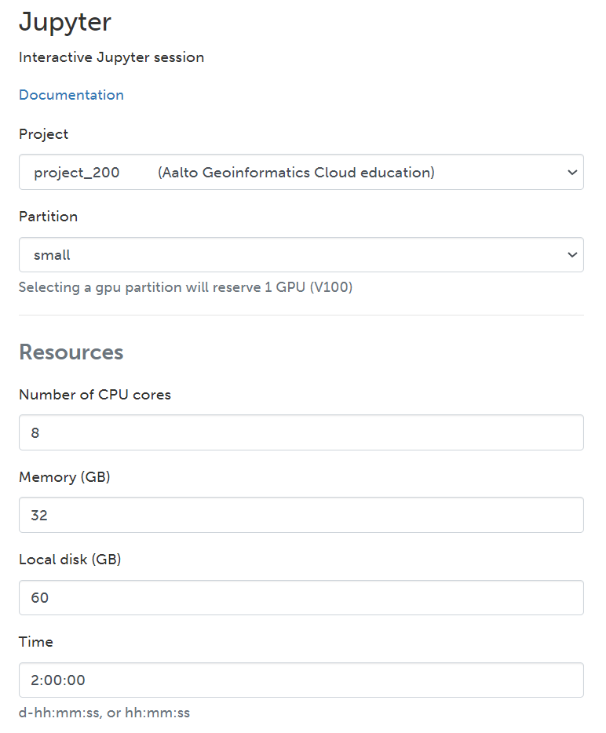

    *Figure 10. Puhti - Jupyter configuration*

If you continue scrolling down you will find the *Settings* section. Under the **Python** parameter you should choose *Custom Path*. 
Then, in the **Custom Python interpreter** you should add the directory of your installed environment container. 

Copy and paste the location of the environment from here (be sure you replace 200xxxx with your project number):

.. code-block:: bash

    /projappl/project_200xxxx/GIT-HPC/env_container/bin/python

For the **Working directory** it is recommended to use the disk *scratch* especially 
if you plan to write a large amount of results.

The *Settings* section might look like Figure 11.

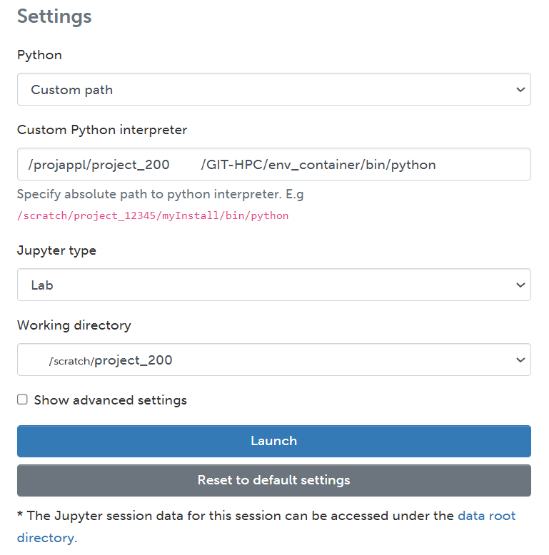
    
    *Figure 11. Puhti - Jupyter and Custom Python interpreter*

Finally, press the **Launch** button. 
You will see the session is launching untill it confirms it is *Running*. It will look like Figure 12.

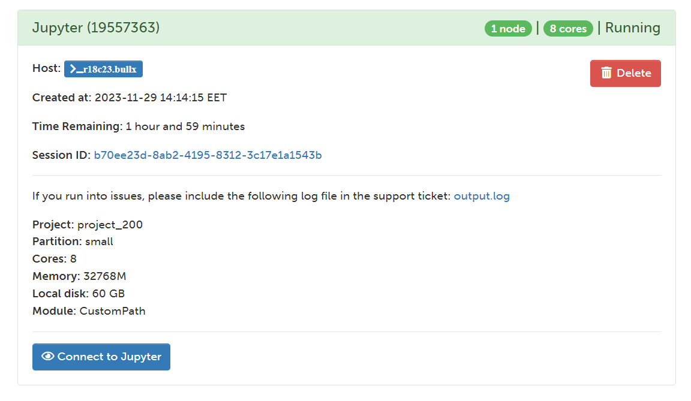
    
    *Figure 12. Puhti - Jupyter and Custom Python interpreter*

Then, press the button **Connect to Jupyter** and *Jupyter Lab* will open.

Find the Lessons in the cloned repository under:

.. code-block:: bash

    /GIT-HPC/GeoHPC/source/lessons

The *Launcher* menu and *Directory* should look like Figure 13.

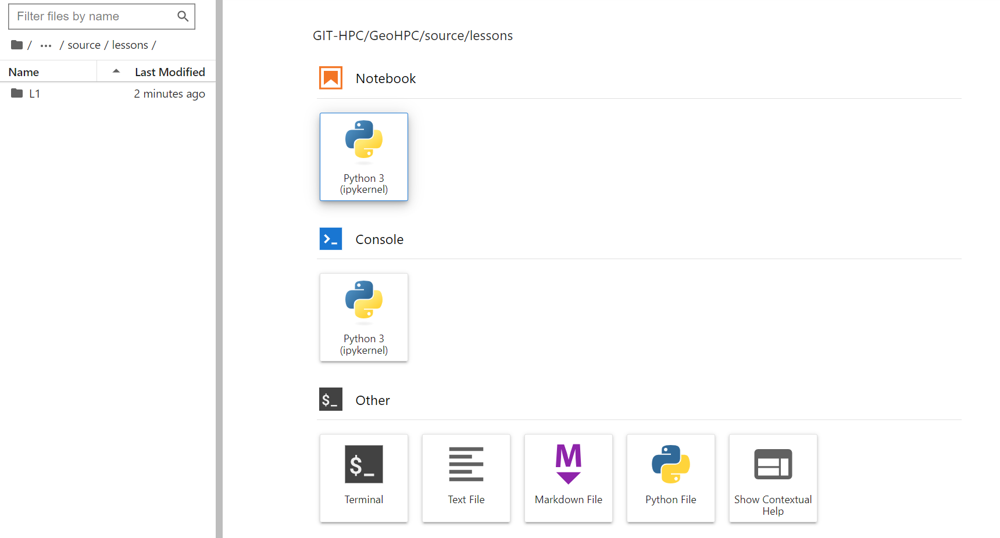
    
    *Figure 13. Puhti - Jupyter Lab and Launcher in lessons directory*

The Jupyter Notebooks for every lessons are in every enumerated folder. For example, the notebook for lesson 1 in **L1**, and so on. 
The notebook name contains simply keywords of the lesson like *Shortest Path*.

Open the Jupyter Notebook of Lesson 1 from:

.. code-block:: bash

    /GIT-HPC/GeoHPC/source/lessons/L1/01_ShortestPath-Parallelization.ipynb

If you have reached until here you are able to start the Lesson 1 using HPC resources and a customized environment container. 
Follow up the instruction in the Jupyter Notebook. 

Happy coding!.

