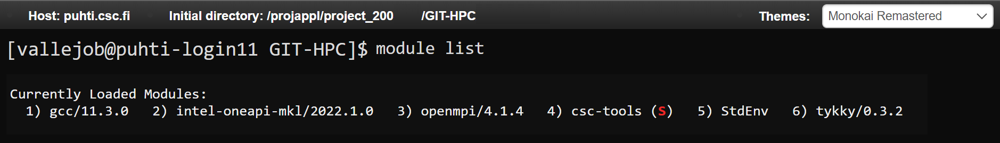

Install customized HPC env 
============================

Log in to Puhti
------------------

The first step to start creating your own space for **High Performance Computing (HPC)** 
is to Log in in the **CSC Puhti supercomputer**.

.. admonition:: CSC Puhti!

    To log in to Puhti supercomputer you need a *CSC account* or *HAKA* credentials.

    .. button-link:: https://www.puhti.csc.fi/public/welcome.html
            :color: primary
            :shadow:
            :align: center

            👉 Log in to Puhti

Create your personal folder
-----------------------------

Once you are logged in you will see the *User Interface* of Puhti that contains that Apps that you can connect the HPC resources (Figure 1). 
Then, we are going to install a containerized Python environment in our **Home Directory** that later on will be connected to **Jupyter Lab**. 

Start opening the **Home Directory**

    
    *Figure 1. Puhti - User Interface*

Once you have opened the **Home Directory**, in the left side, you will see the code of your project like *project_200xxxx* 
in two different Disk section like **projappl** and **scratch**. You should know that the scratch Disk must be used temporary 
because it has a regular clean up (every 180 days) meanwhile the projappl Disk has no clean up. In the projappl Disk 
the capacity is 50GiB and in the scratch Disk the capacity is 1TiB. You can read more about the 
Disk partition in `CSC Disk areas <https://docs.csc.fi/computing/disk/>`_. For the lesson, feel free 
to use any of **scratch** or **projappl**. 

Start creating a new folder called **GIT-HPC** (Figure 2).

.. figure:: img/img2.png
    
    *Figure 2. Puhti - Home Directory personal set up*

Clone the repository
----------------------

Once you have your folder ready it is time to clone the repository with the needed material like the coding Notebooks and the **environment.yml** file 
that we will use to creating our environment. Take a look in the menu on top you have the option **>_ Open in Terminal** like in Figure 3.

Open your folder in terminal.

.. figure:: img/img3.png
    
    *Figure 3. Puhti - Home Directory and Open in Terminal button*

Then, you will have a view of the terminal like in Figure 4. It will contain your new folder as a directory and your user log in.

    
    *Figure 4. Puhti - Terminal*

We will clone the Repository in Puhti using **Git**. Copy and paste in your open terminal the next line (ommit the symbol $):

.. code-block:: bash

    $ git clone https://github.com/AaltoGIS/GeoHPC.git

It should be like in Figure 5.

.. figure:: img/img5.png
    
    *Figure 5. Puhti - Clone the repository using terminal*

You can also explore a bit the repository on GitHub here:

.. button-link:: https://github.com/AaltoGIS/GeoHPC
            :color: primary
            :shadow:
            :align: center

            👉 GeoHPC Repository

Once the Repository is cloned it should be abvailable in your Directory. You can check using the next command:

.. code-block:: bash

    $ ls

If you are willing to know more about Linux commands you can check in the `Linux commands from CSC documention <https://docs.csc.fi/support/tutorials/env-guide/using-linux-in-command-line/>`_.

Finally you can clear the terminal, if you want, using the command:

.. code-block:: bash

    $ clear

Install *Tykky* module
-------------------------

The Tykky module is a container wrapper that helps to install software in HPC. It can be used to container and conda environment 
using an **environment.yml** file. We will activate the Tykky module and install a customized environment that we will use further 
with our notebooks.

.. First, let's set up the folder **env** as our root directory using terminal from the cloned repository, using the command:

.. .. code-block:: bash

..     $ cd GeoHPC/env

.. Then, we will see that our terminal has the root folder **env** and you can check with command **ls** that it contains a **environment.yml** 
.. file.

To start, give a quick look to the modules already loaded using:

.. code-block:: bash

    $ cd module list

.. figure:: img/img6.png
    
    *Figure 6. Puhti - Modules*

Then, you will remove all modules:

.. code-block:: bash

    $ module --force purge

If you check again with **module list** you will notice that there are no modules loaded.

Then, add *Tykky* module:

.. code-block:: bash

    $ module add tykky

Be sure that you have added *Tykky* using **module list**, it will tell like in Figure 7.

    
    *Figure 7. Puhti - Module tykky*

Now, we will containerize our environment using *tykky* and *mamba*. We need to specify two directories: 1) the folder 
where you will containerize the environment, and 2) the **environment.yml** file.

The command we will use has the form *conda-containerize new --mamba --prefix {folder-directory} {environment.yml}*

You can use the next command (be sure you replace 200xxxx with your project number):

.. code-block:: bash

    $ conda-containerize new --mamba --prefix GeoHPC/env GeoHPC/env/environment.yml

.. admonotion:: Notice!

    *Tykky* is currently on maintenance the installation might not be successful at the moment.
    
.. It will start installing your environment and it should give a successful message like Figure 8.

.. .. figure:: img/img8.png
    
..     *Figure 7. Puhti - Environment containerized using tykky*

Activate your environment
-----------------------------
...

Open Jupyter Notebooks with custom path 
-------------------------------------------
...

