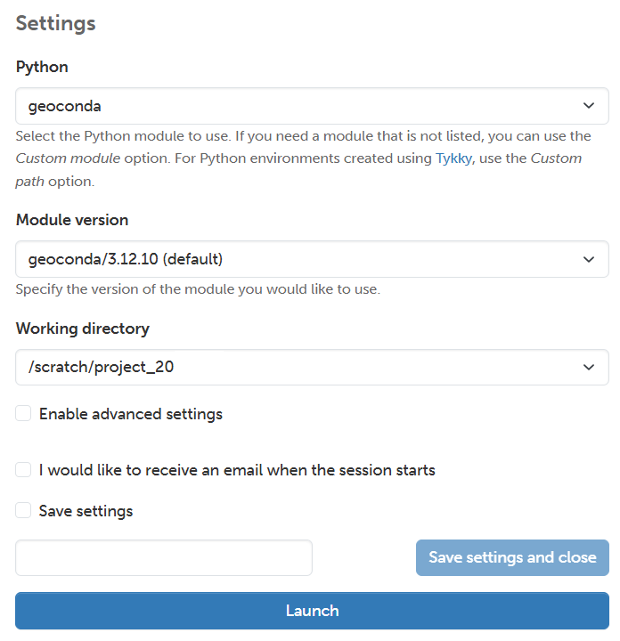
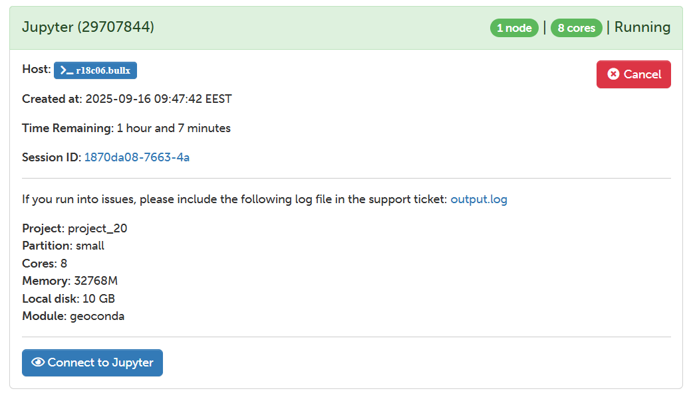
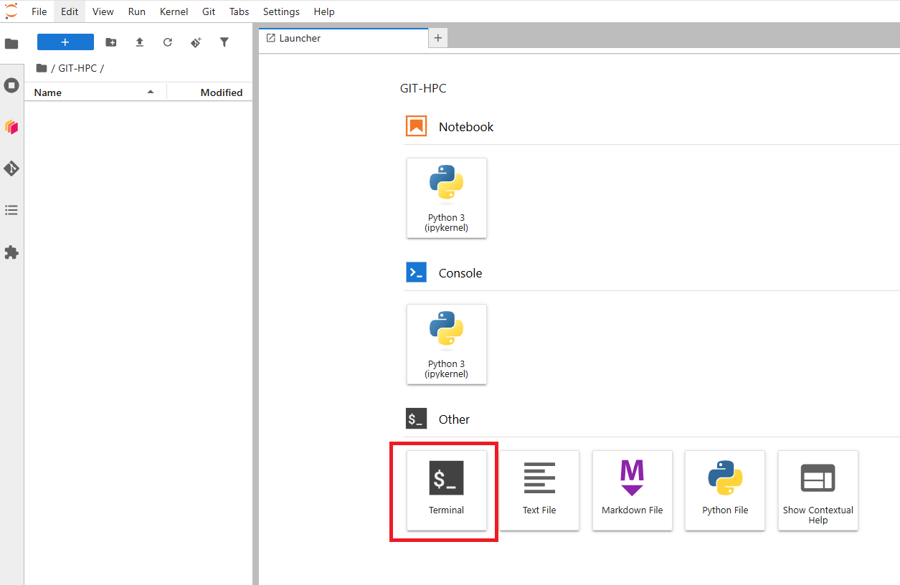

Using GIS libraries on Puhti
=============================

In Puhti supercomputer there is an already installed environment for geospatial analysis called **Geoconda**.
Geoconda is a customized Python environment for geospatial analysis. 
It contains a wide variety of packages for geospatial data processing, analysis, and visualization. The most common ones 
that will be used in the next tutorials are: geopandas, dask-geopandas, osmnx, datashader, and matplotlib.

This environment must be set up during the Jupyter session. The following steps will guide you through the 
process of loading the Geoconda environment in CSC's Puhti supercomputer.

Geoconda was developed by CSC-IT Center for Science and Geoportti. You can find more information 
in the `Geoconda documentation <https://docs.csc.fi/apps/geoconda/>`_.

Follow the next steps in order to load Geoconda for the next tutorials.

Log in to Puhti
------------------

The first step to start with **High Performance Computing (HPC)** 
is to log in in the **CSC Puhti supercomputer**.

.. admonition:: CSC Puhti!

    To log in to the web interface of Puhti supercomputer you need a *CSC account* or *HAKA* credentials. Be sure 
    that you have been granted resources as explained in the previous section.

    .. button-link:: https://www.puhti.csc.fi/public/
            :color: primary
            :shadow:
            :align: center

            👉 Log in to Puhti

Set up a Jupyter Session
-----------------------------

.. .. note::

..    The following assumes that you have access to CSC Finland's computing resources. In case you do not have access to CSC's resources,
..    you can still install JupyterLab and all the required Python libraries used in the lessons by installing the `environment.yml <https://github.com/AaltoGIS/GeoHPC/blob/master/env/environment.yml>`__
..    using mamba/micromamba/miniconda package managers. Learn more about `installing packages from here <https://pythongis.org/part1/chapter-01/nb/06-installation.html>`__
..    and `running a JupyterLab <https://pythongis.org/part1/chapter-01/nb/06-installation.html#running-jupyterlab>`__ on your own computer.

The Puhti supercomputer has a user interface that allows you to access different applications like *Visual Studio Code*, 
*Julia*, *MATLAB*, *MLflow*, *RStudio*, *TensorBoard*, and the one we will use *Jupyter*. 

To access the **Jupyter Lab** application you navigate to the User Interface menu in the Puhti dashboard or
opening the **Apps** menu in the upper menu. If are logged in you can access to the dashboard using this link: 

.. admonition:: CSC Puhti dashboard!

    To access Puhti dashboard you need to log in with a *CSC account* or *HAKA* credentials.

    .. button-link:: https://www.puhti.csc.fi/pun/sys/dashboard
            :color: primary
            :shadow:
            :align: center

            👉 Puhti dashboard!

Simply, to start the **JupyterLab** click on the **Jupyter** button, like in Figure 1.

.. figure:: img/img10.png
    
    *Figure 1. Puhti - Dashboard and Jupyter*

Then, you need to configure the needed resources for your *Jupyter session*.
Be sure you have selected your own **project** like *project_200xxxx*. In this case, we are using **partition** interactive which has maximum 8 cores 
which is enough for our need. If you are willing to know more about the partitions find it in the 
`Puhti Partitions Documentation <https://docs.csc.fi/computing/running/batch-job-partitions/>`_.

For our parameters we will reserve 8 cores, 32 GB of processing memory, 60 GB of local disk, and 2 hours of availability.
Your resources for now should look like Figure 2. Be sure that you are using your resources personally. 

.. note::

   If more people is sharing resources this configuration is not optimal and you must decrease resources.

.. figure:: img/img11.png
    :scale: 80%

    *Figure 2. Puhti - Jupyter configuration*

If you continue scrolling down you will find the *Settings* section. Under the **Python** parameter you should choose *geoconda*. 
Then in *Module version* you select the Geoconda version. We will work using the latest version (default).
Finally, select your **Working directory**. It is recommended to use the disk *scratch* for working especially 
if you plan to write a large amount of results.

The *Settings* section might look like Figure 3.

    
    *Figure 3. Puhti - Jupyter and Geoconda environment*

Finally, press the **Launch** button. 
You will see the session is launching untill it confirms it is *Running*. It will look like Figure 4.

    
    *Figure 4. Puhti - Jupyter and Custom Python interpreter*

Then, press the button **Connect to Jupyter** and *Jupyter Lab* will open.

Clone the GeoHPC Repository
-------------------------------
In the Jupyter Lab interface, first create a new folder where you will clone the repository with the materials for the lessons. 
For this practice, we will call it **GIT-HPC**. You can create a new folder by using right-click in the *Directory* section and selecting *New Folder*. 
Then, navigate inside the folder *GIT-HPC* open a new terminal by clicking the **Terminal** icon in the *Launcher* menu like in Figure 5.

    
    *Figure 5. Puhti - Jupyter Lab and Terminal*

Once the terminal is open you can clone the GeoHPC repository using the following command:

.. code-block:: bash

    git clone https://github.com/AaltoGIS/GeoHPC.git

Once you have cloned the **GeoHPC** repository you will find the Jupyter Notebook lessons under the folder:

.. code-block:: bash

    /GIT-HPC/GeoHPC/source/lessons

The Jupyter Notebooks for every lessons are in every enumerated folder. For example, the notebook for lesson 1 in **L1**, and so on. 
The notebook name contains simply keywords of the lesson like *Shortest Path*.

Open the Jupyter Notebook of Lesson 1 from:

.. code-block:: bash

    /GIT-HPC/GeoHPC/source/lessons/L1/01_ShortestPath-Parallelization.ipynb

If you have reached until here you are able to start the Lesson 1 using HPC resources and a customized environment container. 
Follow up the instruction in the Jupyter Notebook. You will be informed at the beginning of each lesson if you need to load Geoconda or a customized environment.

Happy coding!.

