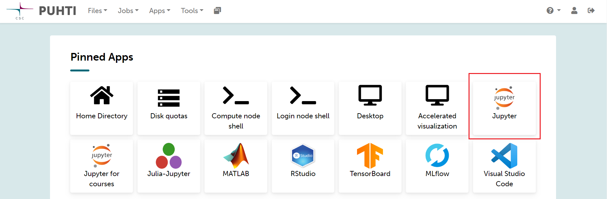
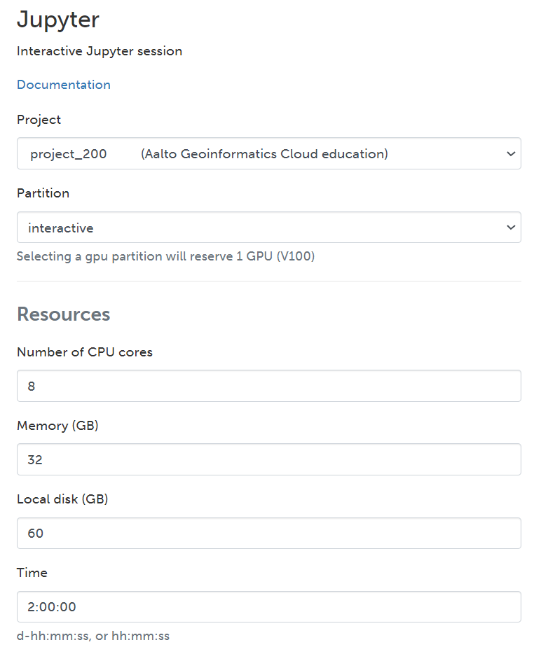

Set up a Jupyter Notebook
===========================

The Puhti supercomputer has a user interface that allows you to access different applications like *Visual Studio Code*, 
*Julia*, *MATLAB*, *MLflow*, *RStudio*, *TensorBoard*, and the one we will use *Jupyter*. 

To access the **Jupyter** application you can simply navigate to the User Interface menu in the Puhti dashboard or 
opening the **Apps** menu in the upper menu. If are logged in you can access to the dashboard using this link: 

.. admonition:: CSC Puhti dashboard!

    To access Puhti dashboard you need to log in with a *CSC account* or *HAKA* credentials.

    .. button-link:: https://www.puhti.csc.fi/pun/sys/dashboard
            :color: primary
            :shadow:
            :align: center

            👉 Puhti dashboard!

Simply, to start the **Jupyter Notebook** click on the **Jupyter** button, like in Figure 1. 

    
    *Figure 1. Puhti - Dashboard and Jupyter*

Then, you will see how the *Jupyter session* starts where you can set up the resources for your Jupyter Notebook.
Be sure you have selected your own **project** like *project_200xxxx*. In this case, we are using **partition** small which has maximum 40 cores 
which is more than enough for our need. If you are willing to know more about the partitions find it in the 
`Puhti Partitions Documentation <https://docs.csc.fi/computing/running/batch-job-partitions/>`_.

For the other parameters, we will reserve 8 cores, 32 GB of processing memory, 60 GB of local disk, and 2 hours of availability. 
Your resources for now should look like Figure 2.

    *Figure 2. Puhti - Jupyter configuration*

If you continue scrolling down you will find the *Settings* section. Under the **Python** parameter you should choose *Custom Path*. 
Then, in the **Custom Python interpreter** you should add the directory of your installed environment container. 

Copy and paste the location of the environment from here (be sure you replace 200xxxx with your project number):

.. code-block:: bash

    /projappl/project_200xxxx/GIT-HPC/env_container/bin/python

Then, choose *Lab* as **Jupyter type** and select your **Working directory** which should be under *projappl*.

The *Settings* section might look like Figure 3.

.. figure:: img/img12.png
    :scale: 60%
    
    *Figure 3. Puhti - Jupyter and Custom Python interpreter*

Finally, press the **Launch** button. 
You will see the session is launching untill it confirm it is *Running*. It will look like Figure 4.

.. figure:: img/img13.png
    
    *Figure 3. Puhti - Jupyter and Custom Python interpreter*

Then, press the button **Connect to Jupyter** and *Jupyter Lab* will open.

Find the Lessons in the cloned repository under:

.. code-block:: bash

    /GIT-HPC/GeoHPC/source/lessons

The *Launcher* menu and *Directory* should look like Figure 4.

.. figure:: img/img14.png
    
    *Figure 4. Puhti - Jupyter Lab and Launcher in lessons directory*

Every folder is named with **L** and the number of the lesson. For example, the notebook for lesson 1 in **L1**. The notebook name 
contains simply keywords of the lesson like *Shortest Path*.

Open the Jupyter Notebook of Lesson 1 from:

.. code-block:: bash

    /GIT-HPC/GeoHPC/source/lessons/L1/01_ShortestPath-Parallelization.ipynb

If you have reached until here you are able to start the Lesson 1 using HPC resources and a customized environment container.