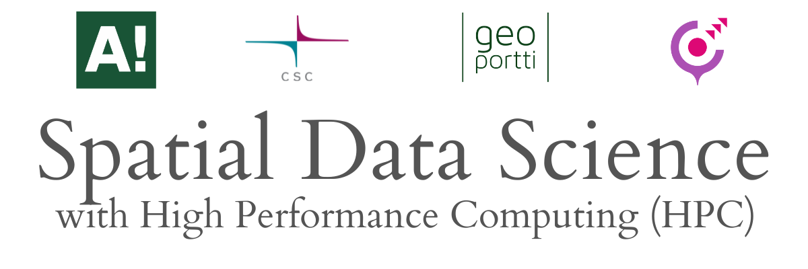

.. geohpc documentation master file, created by
   sphinx-quickstart on Thu Nov 16 13:23:50 2023.
   You can adapt this file completely to your liking, but it should at least
   contain the root `toctree` directive.

The **Spatial Data Science with High Performance Computers (HPC)** course introduces...

Prerequirements
-----------------
... 

Course format
----------------
... 

.. admonition:: Aalto University students

    The Spatial Data Science with HPC course....

.. admonition:: Interactive contents

    Each lesson in this course can be turned into an interactive programming session in the browser.
    You can find buttons for...

Program
---------
... 

.. table

Content
---------
... 

.. toctree::
   :maxdepth: 1
   :caption: Course information

   course-info/introduction

.. toctree::
   :maxdepth: 2
   :caption: Getting started

   getting-started/activate-account
   getting-started/install-env
   getting-started/set-up-jupyter
   getting-started/desktop-connect

.. toctree::
   :maxdepth: 3
   :caption: Lesson 1

   lessons/L1/01_ShortestPath-Parallelization.ipynb

.. toctree::
   :maxdepth: 3
   :caption: Lesson 2

   lessons/L2/allas-access

.. .. toctree::
..    :maxdepth: 2
..    :caption: Long run development test

..    lessons/test/01_ShortestPath-LongRun-16cores.ipynb

..
   * :ref:`genindex`
   * :ref:`modindex`
   * :ref:`search`
