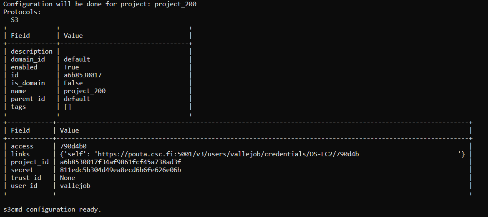

Access Allas 
===============

Allas is a storage server part of CSC resources that can be accessed from anywhere with CSC credentials and internet. 
Allas storage is allocated by specific project_200xxxx and it can be active while the project is active.

Data files are stored in Buckets (container) and can be accessed with protocol Swift or S3. If you want to know more about Allas take a look the `Allas documentation <https://docs.csc.fi/data/Allas/introduction/>`_. 

In this Lesson we are going to access our data in Allas with the S3 Protocol. We will first configure Allas and S3 and then we will use it in our notebook. If you want to know more about S3 in Allas find examples in the 
`CSC's S3 connection in Allas (in construction) <https://github.com/CSCfi/csc-user-guide/blob/ktiits-boto3/docs/data/Allas/using_allas/python_boto3.md>`_. 

Start accessing your Terminal in your project_200xxxx directory in Puhti or directly using Jupter Lab. Both options work.

.. admonition:: My CSC!

    To log in to My CSC you need a *CSC account* or *HAKA* credentials.

    .. button-link:: https://my.csc.fi/login
            :color: primary
            :shadow:
            :align: center

            👉 Log in to My CSC

Configure S3 and Allas
---------------------------

To configure S3 in your project first you have to add Allas module, type the next command.

.. code-block:: bash

    $ module add allas

You can confirm that Allas module is added using `module list`

Then, configure Allas using S3 protocol, using the next command.

.. code-block:: bash

    $ allas-conf --mode s3cmd

Afterwards, it will ask for you **CSC Password** and you will choose the project_200xxxx that you want to add connection. The success message looks like Figure 2.

    
    *Figure 1. Allas - S3 connection success*

Connect to Allas using Python
-------------------------------

