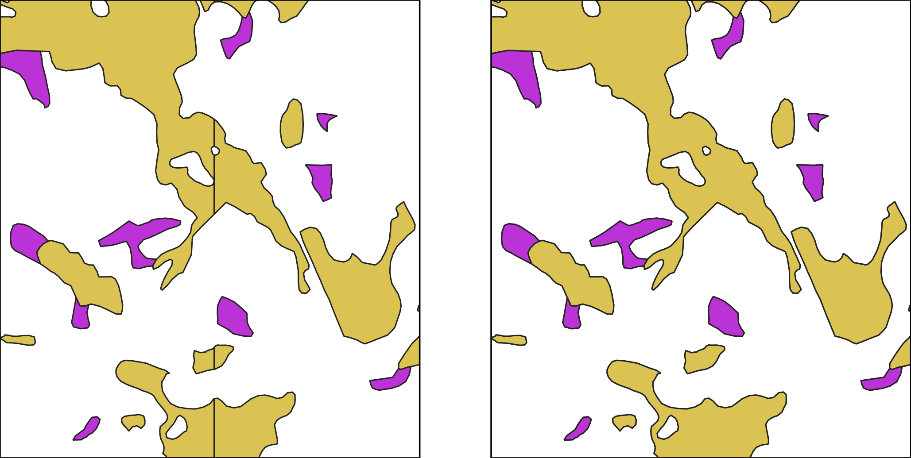
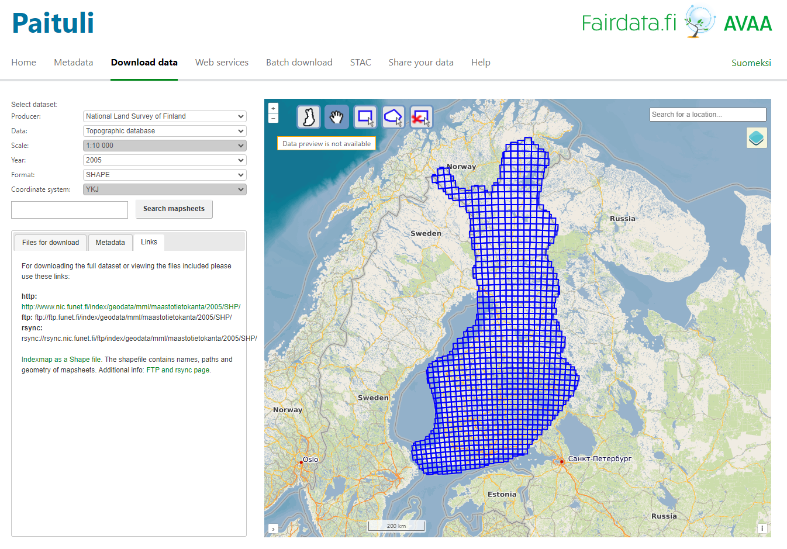
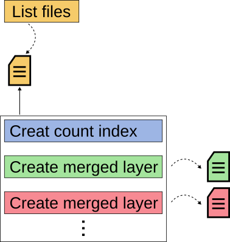
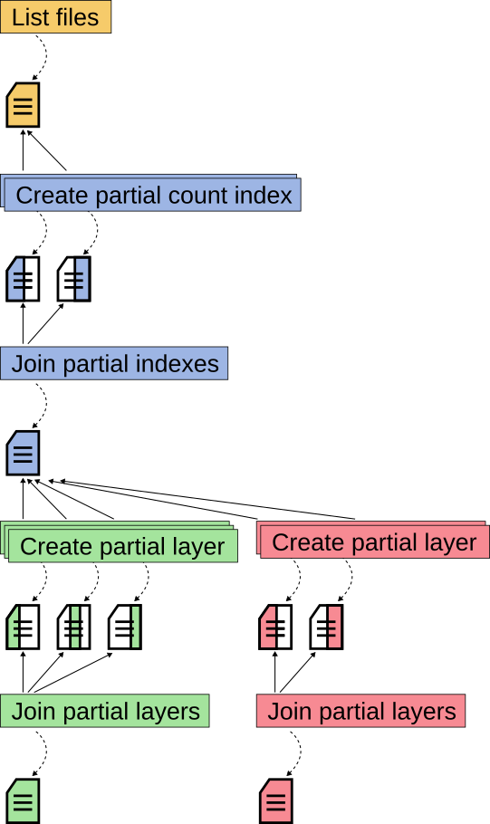

Lesson 4 - Merging Tiled Vectors
=================================
..
    Ville Mäkinen
    ville.p.makinen@nls.fi
    Finnish Geospatial Research Institute, National Land Survey of Finland
    Version 1.0 03.05.2024

Merging Tiled Vector Data into country-wide layers
----------------------------------------------------

    A snapshot of the Topographic Database (TDB). The features located at the edge of the tiles are split into multiple parts and require to be merged for multiple uses.

Introduction
------------

The Topographic Database (TDB) of the National Land Survey of Finland (NLS) has turned
out to be an important source of data for numerous use cases. One has been
change detection, for example the evolution of agricultural areas. Unfortunately
the NLS provides only the current version of the TDB, any previous versions are not available.

Luckily, CSC has stored a few snapshots from the past years in Paituli service. Unlike the current GeoPackage that the NLS now provides, the older versions are split into regular tiles. 
Features that happen to be located at the edge of the tiles are split into multiple parts. For many use cases the tiles must be first joined into a single layer and the split parts merged 
back to their original shape. In addition, in the oldest versions the geometries are in the YKJ coordinate system, whereas the newer ones have switched to ETRS-TM35FIN(E,N).

As a Geoportti service the tiles have been merged back into country-wide layers which are available in Paituli as well. In this exercise we go through one way this can be achieved.

Disclaimer
-----------

This excercise describes a simple method to split a problem into smaller sub-problems that can be solved in parallel. 
In practise there are numerous different approaches to achieve this. The actual implementation is not optimized in any way. 
For example, we will be writing intermediate results on disks, which is something to avoid if speed is crucial for the use case. 
However, our approach is easy to implement and it is easy to see what has happened after each step. 
We will consider only polygon geometries, but line features can be joined in a similar manner.

**Note!** 

This exercise contains a first section where the user will run the code in the local computer. During this local test, the 
process is not running in parallel. The purpose in running locally is to learn the use of terminal and scripts. Then, it contains a 
parallelization strategy based on indexes to facilitate the understanding before starting with the supercomputer. 

Python code 
----------------

.. attention:: 
    Be aware that in this practice we will run a test in your local computer and later on we will 
    run in parallel using Puhti supercomputer. For the practice on your local computer, you can download 
    the Python code the Python code from Allas. Unzip the folder in your working directory. 
    
    For Puhti computer, the Python code is already included 
    since you cloned the `GeoHPC Github Repository <https://github.com/AaltoGIS/GeoHPC>`_

    .. button-link:: https://a3s.fi/swift/v1/AUTH_a6b8530017f34af9861fcf45a738ad3f/L4-fgi/src.zip
                :color: primary
                :shadow:
                :align: center

                👉 Download Python code

Data download
---------------

Each tile in the dataset is a zip file that contains several shapefiles, `check the naming and the contents of the shapefiles <https://etsin.fairdata.fi/dataset/8afb7771-f7d1-4030-85fd-b9271d81b298>`_. 
In the oldest snapshots the geometries are stored in YKJ coordinate system, the newer ones are in ETRS-TM35FIN(E,N). Each original feature had a unique ``KOHDEOSO`` attribute. 
If the feature has been split into several tiles, each part in the tiled version has the same value. We will take advantage of this in the process.

    Al left, the features at the edges of two tiles, colored by their ``LUOKKA`` attribute. On the right, the features with the same ``KOHDEOSO`` attribute are merged.

Download test file from Paituli.

  - Create a directory ``2005_tiles`` into the working directory
  - Download files ``LM22O2D.ZIP`` and ``LM22P1C.ZIP`` from `Paituli <https://paituli.csc.fi/download.html>`_

    - In the interface: *National Land Survey of Finland, Topographic Database, 2005, SHAPE*.
    - In the box below, select the `Links` tab and go to the http address to access the tiles directly (*as image below*)

    Paituli interfaces and tiled vector data template

Work plan
-----------

We will develop a program that will:

- extract all the features whose class we are interested in,
- join the possibly split parts into one,
- reproject the geometries into ETRS-TM35FIN(E,N) coordinate system (if needed), and
- store these into an output file in one layer.

We start by implementing and testing the method on our local computer with small test data. Once we get that working, we will transfer the approach to Puhti supercomputer. We will consider different parallelization approaches and modify our implementation accordingly.

Prerequisites
-------------

We will implement our workflow as Python 3 scripts. Basic Python knowledge is therefore required. We will be using the following Python libraries:

- `Fiona <https://fiona.readthedocs.io/en/stable/manual.html>`_: For reading and writing geospatial data.
- `Shapely <https://shapely.readthedocs.io/en/stable/manual.html>`_: For handling and processing the geometries of the features.
- `Pyproj <https://pyproj4.github.io/pyproj/stable/index.html>`_: For transforming the geometries from YKJ to ETRS-TM35FIN coordinate system.

Fiona and Shapely libraries use the `GDAL <https://gdal.org/index.html>`_ library under the hood, and pyproj is a Python interface to `PROJ <https://proj.org/en/9.3/>`_ library.

In the later stage we will be using Puhti supercomputer from terminal, so basic Linux skills are required in that part.

**Some important concepts:**

- It is recommended to create a `Python virtual environment <https://docs.python.org/3/library/venv.html>`_ for the exercise.
- The understanding of different geometry types in Fiona/Shapely context:

  - https://fiona.readthedocs.io/en/stable/manual.html#geometry-types
  - https://datatracker.ietf.org/doc/html/rfc7946
  - https://en.wikipedia.org/wiki/Simple_Features

Note for Windows users
----------------------
- In the examples we sometimes write for example `python main.py`. On Windows machines you may need to write `python.exe main.py` instead.
- On Windows directory paths use the backslash ``\`` as the path separator. In scripts it is treated as an escape character and will cause issues. Therefore it is recommended to use the forward slash ``/`` as a path separator in Python scripts on Windows as well.

Hands on coding (Local)
===========================

Setting up the exercise environment
-------------------------------------

It is usually a good idea to start the development of a workflow with a small sample dataset. In that way you can rerun the analyses quickly and fix all simple and obvious issues fast. Therefore we will create a test environment for ourselves:

- Be sure that you have installed `Anaconda <https://www.anaconda.com/download>`_ in your system.
- Create a Python virtual environment for the exercise.

.. code-block:: bash

    conda create -n mygeohpc -c conda-forge python=3.10 shapely pyproj gdal fiona

- Activate your installed Conda environment.

.. code-block:: bash

    conda activate mygeohpc

- Check the `tinshift <https://github.com/OSGeo/PROJ-data/blob/master/fi_nls>`_ file **fi_nls_ykj_etrs35fin.json**. Download the raw file as *json*. The File is already given in the **src** folder.

- Be sure that your test data is in the folder `2005_tiles`

Your working directory (can be anything, we use ``L4`` in this example) should now look like this:

.. code-block:: bash

    L4/
    |---fi_nls_ykj_etrs35fin.json
    |---src/
    |---2005_tiles/
        |---LM22O2D.ZIP
        |---LM22P1C.ZIP

Principal idea
------------------

When we iterate over the features from a tile, we have no easy way of knowing if there will be more parts in the same or other tiles with the same ``KOHDEOSO``. Therefore we will develop a two-part process to create joined layers.

**In the first part** we will iterate over all the features in all of the tiles and count the occurrences of the ``KOHDEOSO`` attribute values. We will store this information to be used in the next part.

**In the second part** we iterate over the tiles again and whenever we have found all the parts for any ``KOHDEOSO``, we will join the parts and save the result.

.. attention::

   If we could not use the ``KOHDEOSO`` attribute, are there any other ways we could use to determine if the given feature is a part of a larger original feature?

Preliminaries
----------------

To make life easier for us we will create a configuration file that describes the layers that we want to generate. File is already given in the **src** of this repository.

.. code-block:: python
    :caption: src/settings.py

    layer_specs = {
        2005: {
            'path_tiles': '2005_tiles',
            'join_attribute_name': 'KOHDEOSO',
            'layers': {
                0: {
                    'include_LUOKKA': [35411, 35412, 35421, 35422, 35300],
                    'filename': '2005_vakavesi.gpkg',
                    'layername': 'vakavesi',
                    'geometry_type': 'Polygon'
                },
                1: {
                    'include_LUOKKA': [
                        42210, 42211, 42212, 42220, 42221, 42222, 42230, 42231,
                        42232, 42240, 42241, 42242, 42250, 42251, 42252, 42260,
                        42261, 42262, 42270
                    ],
                    'filename': '2005_rakennus.gpkg',
                    'layername': 'rakennus',
                    'geometry_type': 'Polygon'
                }
            }
        }
    }

    output_settings = {
        'path': 'test_out'
    }

    #
    # Some checks for the settings.
    #

    #
    # Make sure that each layer is going into a separate output file.
    #
    for d in layer_specs.values():
        layer_names = [layer['filename'] for layer in d['layers'].values()]
        n = len(layer_names)
        m = len(set(layer_names))
        if m < n:
            raise Exception('Outputting different layers to the same file is not implemented.')
        

.. note::

    At this point we could use the same output file and write multiple layers into the same GeoPackage. When we move on to parallel processing, having separate output file for each process make life easier.

We will also list all the files in the input directory and save that list for later use.

.. literalinclude:: src/main_list_files.py
   :caption: src/main_list_files.py

.. literalinclude:: src/utils.py
    :caption: src/utils.py
    :pyobject: list_zipfiles

Step 1: count ``KOHDEOSO`` attribute value occurrences
==============================================================

In this step we will go though the features in each tile and count the occurrence of the different ``KOHDEOSO`` attribute values. Once we have iterated over all the features from the tiles, we can find out if we need to merge features by looking at their ``KOHDEOSO`` attribute value.

.. attention::

    Is it possible that some ``KOHDEOSO`` appears only once but the feature was split anyway?

The tiles are .zip files that contain several .shp files and the related auxiliary files. In theory we would first need to extract the files from a .zip file, analyse the layers, and optionally delete the extracted files before moving on to the next .zip file. Luckily, we can cut some corners because GDAL is able to read data from inside .zip files automatically using the VSIZIP Virtual File System:

.. dropdown:: GDAL command line example

    .. code-block:: bash
       :caption: Using GDAL from command line using *GEOHPC* folder as root.

        $ ogrinfo 2005_tiles/LM22O2D.ZIP

        >> ogrinfo failed - unable to open 'LM22O2D.ZIP'.

        $ ogrinfo /vsizip/2005_tiles/LM22O2D.ZIP

        >> INFO: Open of `/vsizip/LM22O2D.ZIP'
        >>       using driver `ESRI Shapefile' successful.
        >> 1: HM22O2DP (Polygon)
        >> 2: HM22O2DT (Point)
        >> 3: HM22O2DV (Line String)
        >> 4: JM22O2DS (Point)
        >> 5: JM22O2DV (Line String)
        >> 6: KM22O2DS (Point)
        >> 7: KM22O2DT (Point)
        >> 8: KM22O2DV (Line String)
        >> 9: LM22O2DS (Point)
        >> 10: LM22O2DT (Point)
        >> 11: LM22O2DV (Line String)
        >> 12: MM22O2DP (Polygon)
        >> 13: MM22O2DS (Point)
        >> 14: MM22O2DT (Point)
        >> 15: MM22O2DV (Line String)
        >> 16: NM22O2DP (Polygon)
        >> 17: NM22O2DS (Point)
        >> 18: NM22O2DT (Point)
        >> 19: NM22O2DV (Line String)
        >> 20: RM22O2DP (Polygon)
        >> 21: RM22O2DS (Point)
        >> 22: RM22O2DT (Point)
        >> 23: RM22O2DV (Line String)
        >> 24: SM22O2DP (Polygon)
        >> 25: SM22O2DS (Point)
        >> 26: SM22O2DT (Point)
        >> 27: SM22O2DV (Line String)

We can use the same approach from Python as well:

.. code-block:: python

    import fiona

    zip_layers = fiona.listlayers('/vsizip/2005_tiles/LM22O2D.ZIP')
    for layer_name in zip_layers:
        print(layer_name)

First we will write a function that opens one of the layers from a .zip file, iterates over the features in that layer, and count the occurrences of different ``KOHDEOSO`` attributes.

.. literalinclude:: src/count.py
    :caption: src/count.py
    :pyobject: count_from_layer

Let's test it:

.. code-block:: bash
   :caption: Using Python from command line (Bash)

    $ (cd src && python -c "from count import count_from_layer; print(count_from_layer('/vsizip/../2005_tiles/LM22O2D.ZIP', 'HM22O2DP', 'KOHDEOSO'))")

    >> {472477868: 1, 582820922: 1, 472478093: 1, 472477863: 2, 472477858: 1}

.. attention::

    Q: One ``KOHDEOSO`` attribute value may appear in multiple tiles, but how is it possible that one tile contains many features with the same ``KOHDEOSO`` attribute value?

Next we introduce two more functions, one to count the occurrences from all the layers in a .zip file, and another to handle all the .zip files in a given path:

.. literalinclude:: src/count.py
    :caption: src/count.py

The function ``add_to_dict`` adds the occurrences of the second dictionary to the first one:

.. literalinclude:: src/utils.py
   :caption: src/utils.py
   :pyobject: add_to_dict

Step 2: merging features and creating joined layers
======================================================

For each layer that we are generating, we will iterate over all the features in the tiles. For each feature whose ``LUOKKA`` attribute matches the current layer,
we check how many features there exists overall with the same ``KOHDEOSO`` attribute value. For the majority of features the number is going to be one, which means that we don't need to do any merging. 
However, if the are multiple features with the same ``KOHDEOSO`` attribute value, we will keep them in memory until we have found all of them. Once all the features with the same ``KOHDEOSO`` are found, we will perform the merging.

It is possible that merging the features results into a multigeometry (multiple parts that are not connected). We opted to use the geometry type ``Polygon`` for the output layer in our ``settings.py``, which means that our 
output layer accepts only single geometries. In this excercise we will keep as much data as possible, and store the possible multigeometries as separate single geometries with the same ``KOHDEOSO`` attribute. 
This means that in the output the ``KOHDEOSO`` may not be unique for each feature.

.. attention::

   - The original features are all single geometries. How can the merging result into a multigeometry?
   - In what other ways we could handle the possible multigeometries?

Let's start by writing the functions that will merge a list of geometries into a multigeometry.

.. literalinclude:: src/merge.py
    :caption: src/merge.py

    
Whether the merging results into a single geometry or a multigeometry, the functions returns a list of single geometries.

We are almost ready to write the final functions for the second part. The last thing to consider is the projection that was used to store the geometries of the features. In the older versions of the TDB the geometries are stored in YKJ (EPSG:2393) projection. Today, the ETRS-TM35FIN projection should be used for national data. The most accurate tranformation between these two coordinate systems is the transformation using triangulated irregular network transformation data in ``fi_nls_ykj_etrs35fin.json``. The file may exists on your computer as a part of the `PROJ` library installation, but you can also download it from `here <https://github.com/OSGeo/PROJ-data/tree/master/fi_nls>`_. `More information about the coordinate transformation <https://www.maanmittauslaitos.fi/kartat-ja-paikkatieto/ammattilaiskayttajille/koordinaattimuunnokset/kkj-ja-euref-fin>`_.

As an extra twist, there are features in some tiles whose coordinates are stored in ETRS-TM35FIN(E,N), although the metadata of the layer indicates YKJ. Thus, we cannot rely on that information. Luckily, in this case we can inspect the coordinate values of a given geometry and determine which coordinate system was used.

.. literalinclude:: src/projection.py
    :caption: src/projection.py

.. dropdown:: About the CRS

    In the newer datasets the geometries are stored using ETRS-TM35FIN(E,N) (EPSG:3067) coordinate system, in which the order of the coordinatesis ``E, N``. The ranges of valid values are for Easting ``[43547.78, 674306.99]`` and for Northing ``[6549298.62, 7782478.68]``. 
    
    In YKJ the order is ``N, E``. The ranges of valid values are for Norting ``[6651895.29, 7785471.56]`` and for Easting ``[3064557.21, 3671136.29]``. 
    
    If we select one coordinate from the geometry of a object and it's first component is greater than 674306.99, we can deduce that the geometry is stored in YKJ coordinate system.

.. attention::

    If you get errors indicating that `proj.db` was not found and you know, where the file is located, 
    you can provide the location in the beginning of the script (before importing any other libraries):

    .. code-block:: python

        import os
        os.environ['PROJ_LIB'] = <Directory path that contains the file "proj.db".>

We now have all the tools to write the functions that iterate over the different layers in the zip files, extract the requested features, merge them, and save them into an output file:

.. literalinclude:: src/create_layer.py
    :caption: src/create_layer.py

.. attention::
   When creating the joined layer, we iterate over all the layers in the zip files. Does this make sense, or could we skip some layers which will not contain features that we are interested in at the moment?

To wrap it all up, we write the main function to execute the necessary functions

.. literalinclude:: src/main.py
    :caption: src/main.py
    :lines: 1-33,44-48,57-

Now, you can run ``main.py`` and provide the ``year`` on the command line, and the program will eventually create the layers defined in the ``settings.py``. 
It will create a new folder `test_out`.

``Run main.py``
-------------------

.. code-block:: bash

    python src/main.py 2005

The visual description of our program looks like the this:

    The schematic work flow of our simple program.
    The schematic work flow of the simple version. The dashed arrows indicate the output of the programs, and solid arrows the dependencies to previous results. Different parallel parts can be run with different number of processes.

.. attention::

    We are not handling almost any errors the code might raise during the execution. This is deliberate: if something goes wrong during the processing that we were not expecting, we will find out and can fix such issues one by one.

Parallelization
====================

Strategies
--------------------------

To take advantage of multiple CPUs the problem must be split into pieces that can be executed concurrently. If the pieces are independent of each other, the problem is sometimes called `embarrassingly parallel`. 
In a more general case, the pieces depend on each other and we must coordinate the different tasks so that they are executed in right order etc.

Let's analyze our approach:

- The count index needs to be generated only once, and when generating the joined layers we need to only read in the count index. Thus, we will split our program into separate index generation and layer generation programs. Once the index is generated, we can choose any sets of feature classes we want and generate the corresponding layers in parallel.
- We can divide the count index generation into multiple tasks as well, where each task counts the ``KOHDEOSO`` attributes from their own share of tiles. In the end, we need to combine the counts from each subset of layers into the global count index.
- The generation of a specific layer can be parallelized as well. Each task can again go through over their subset of tiles and extract the original and split features into a temporary location. However, only when each tasks has finished extracting features can we merge the split features and create the final output.

After this analysis we will rewrite our program into the following form:

- Create count index

  - Count the ``KOHDEOSO`` attributes from a subset of tiles [P]
  - Group the partial results into a global count index.

- Create a joined layer

  - Extract the features from a subset of tiles [P]
  - Group the results, merge split features, and save into the final output

The letter P refers to parallelizable. Notice that there are now multiple options to use the available CPUs. For example, let's say that our machine has four CPUs. In the global index creation we can divide the tiles into four subsets and gather the results. However, for creating the joined layers, we can

    1) create one layer at the time and process the tiles in four parts,
    2) create four layers at the same time but only use one CPU for each layer, or
    3) create two layers in parallel and process the tiles in two parts for both layers.

We will split our previous ``main.py`` into several programs that will only perform some part of the original functionality:

    The schematic work flow of the parallel version. The dashed arrows indicate the output of the programs, and solid arrows the dependencies to previous results. Partially colored files represent partial results. Different parallel parts can be run with different number of processes.

Processing the tiles in parallel
--------------------------------

We will implement our parallel workflow in such a way that each task can run independently of the other task at the same level. 
For this, we need some method to tell each task which files it should process. 
We will use the scheme where each task is told the number of task solving the "same" problem (``procs``) and what is their order (``rank``) in that group. 
For example, if we parallelize using four tasks, the ``procs`` is 4 and the ``rank`` values are 0, 1, 2, and 3.

Creating partial count indexes
------------------------------

We are now ready to write the program that will produce a partial count index from a well-defined subset of tiles. The program does not require the ``layer_id`` as an input since we iterate over every feature in the given tiles anyway. However, the ``procs`` and ``rank`` are provided as command line arguments in addition.

.. literalinclude:: src/main_create_partial_index.py
   :caption: src/main_create_partial_index.py
   :emphasize-lines: 36

Notice how we use the ``rank`` and ``procs`` to select only some entries from the ``file_list``.

``Run main_create_partial_index.py``
--------------------------------------

.. code-block:: bash

    $ python src/main_create_partial_index.py 0 2 2005
    $ python src/main_create_partial_index.py 1 2 2005

.. code-block:: bash
    :emphasize-lines: 4-5

    test_out/
    |---2005/
        |---files_2005.pckl
        |---index_2005.pckl.0_2
        |---index_2005.pckl.1_2

Creating the global count index
-------------------------------

Once the tasks have finished and created their attribute occurrence indexes, we can join the results into the final index. 
This program is not parallelized, so we don't provide the ``rank`` but we tell how many partial indexes it should find by providing the ``procs`` parameter.

.. literalinclude:: src/main_join_partial_indexes.py
   :caption: src/main_join_partial_indexes.py

``Run main_join_partial_indexes.py``
----------------------------------------

.. code-block:: bash

    $ python src/main_join_partial_indexes.py 2 2005

.. code-block:: bash
    :emphasize-lines: 4

    test_out/
    |---2005/
        |---files_2005.pckl
        |---index_2005.pckl
        |---index_2005.pckl.0_2
        |---index_2005.pckl.1_2

Extracting features in parallel
-------------------------------

With the count index we can move on creating the joined layers.

.. note:: 
    
    Actually, if we only want to create multiple layers at the same time with one CPU on each layers, 
    we have all the building blocks available already and only need to reimplement the ``main()`` 
    to accept the layer to be processed from the command line and read in the global occurrence index.

However, we are a bit more ambitious and want to be able to use multiple CPUs to create a single layer. 
For this, we need to modify our previous approach on this part as well. 
Mainly, each task will iterate over their share of zip files, and write their output to a separate temporary output files. 
After each task has finished, one final execution is needed where the partial layers are joined and merged into the final layer.

First we write the program for each task. We also need to re-implement some previous functionality for parallel execution.

.. literalinclude:: src/main_create_partial_layer.py
    :caption: src/main_create_partial_layer.py

.. literalinclude:: src/create_layer_parallel.py
    :caption: src/create_layer_parallel.py
    :lines: 1-10, 47-

Let's run this for our test data of two tiles with two tasks.

``Run main_create_partial_layer.py``
------------------------------------- 

.. code-block:: bash

    $ python src/main_create_partial_layer.py 0 2 2005 0
    $ python src/main_create_partial_layer.py 1 2 2005 0

Once these tasks are done, the output directory should contain the following files:

.. code-block:: bash
    :emphasize-lines: 3-6

    test_out/
    |---2005/
        |---2005_vakavesi.gpkg.0_2_parts
        |---2005_vakavesi.gpkg.0_2_single
        |---2005_vakavesi.gpkg.1_2_parts
        |---2005_vakavesi.gpkg.1_2_single
        |---files_2005.pckl
        |---index_2005.pckl
        |---index_2005.pckl.0_2
        |---index_2005.pckl.1_2

Creating the joined layers
--------------------------

Now all we need to do is combine the partial GeoPackage files into the final layer. The features in `*.single` files can be saved as they are, but the ones from `*.parts` files must be merged first.

.. literalinclude:: src/main_join_partial_layers.py
    :caption: src/main_join_partial_layers.py

.. literalinclude:: src/create_layer_parallel.py
    :caption: src/create_layer_parallel.py

``Run main_join_partial_layers.py``
--------------------------------------
Running this program produces the final merged layer.

.. code-block:: bash

    $ python src/main_join_partial_layers.py 2 2005 0

.. code-block:: bash
    :emphasize-lines: 3

    test_out/
    |---2005/
        |---2005_vakavesi.gpkg
        |---2005_vakavesi.gpkg.0_2_parts
        |---2005_vakavesi.gpkg.0_2_single
        |---2005_vakavesi.gpkg.1_2_parts
        |---2005_vakavesi.gpkg.1_2_single
        |---files_2005.pckl
        |---index_2005.pckl
        |---index_2005.pckl.0_2
        |---index_2005.pckl.1_2

Moving to Puhti (HPC)
==========================

Clone repository
------------------
Be sure that you have cloned the repository of this lesson. 
The Python code needed for this practice is included in the Lesson 4 folder.
If wanted you can find instructions in the 
section `Clone the Repository <https://geohpc.readthedocs.io/en/latest/getting-started/install-env.html#clone-the-repository>`_

Find the GeoHPC repository here.

.. button-link:: https://github.com/AaltoGIS/GeoHPC
            :color: primary
            :shadow:
            :align: center

            👉 GeoHPC Repository

Set up *HOME* folder and data
--------------------------------
As a recomendation, set up in your terminal the folder of Lesson 4 ``/projappl/project_200xxxx/GeoHPC/source/lessons/L4`` as your ``$HOME``

You can give a review the tiles in Paituli as it was explained before. 
For now, add the data folder directly from Allas using the next line.

.. code-block:: bash

    wget -N https://a3s.fi/swift/v1/AUTH_a6b8530017f34af9861fcf45a738ad3f/L4-fgi/2005_tiles.zip && unzip 2005_tiles.zip

Once you have navigated in terminal to yor $HOME folder it will have the next resources available.

.. code-block:: bash

    $HOME/
    |---fi_nls_ykj_etrs35fin.json
    |---src/
        |---count_parallel.py
        |---count.py
        |---create_layer_parallel.py
        |---create_layer.py        
        |---main_create_partial_index.py
        |---main_create_partial_layer.py
        |---main_join_partial_indexes.py
        |---main_join_partial_layers.py
        |---main_list_files.py
        |---merge.py
        |---projection.py
        |---utils.py
    |---2005_tiles
        |---LM22O2D.ZIP
        |---LM22P1C.ZIP

Set up settings file
--------------------------

In this exercise the tasks don't need heavy resources and will probably get executed quite quickly. 
Second big thing is that you should not use the home directory to store or write large datasets. 
Instead, there is a separate `scratch` partition for this purpose. 
The exact path depends on the project you are using, 
but we assume that the path is ``/scratch/project_200xxxx``.

We need to adapt our ``settings.py`` to Puhti.
Mainly, we need to change to path to find the map sheet .zip files and to output directory.

.. literalinclude:: src/settings.py
    :caption: settings.py
    :emphasize-lines: 3,27
    

Writing a serial job file
-------------------------------
There are some major differences in using Puhti compared to running things on your local computer. 
First is that you should not run any heavy computations interactively. 
Instead, you describe the work you wish to do in a `job file` and submit this job to the queue. 
Puhti will then take your job from the queue and run it when there are adequate resources available. 

There is extensive documentation at `CSC job scripts <https://docs.csc.fi/computing/running/creating-job-scripts-puhti/>`_. 
We will not replicate the whole thing, so use that as a reference.

Let's find in the directory ``$HOME/src`` our first job file and modif it as needed. 
A job file is actually a Bash script that the queue executes. 
We request the computing resources for our job via special parameters in the job file.

About python env
------------------

This is a minimal job file. We give the job some name, the project whose resources we are using, 
the maximum running time etc. The command ``module load`` loads a module called ``geoconda``. 

Geoconda contains numerous geospatial Python libraries, so we don't need to install anything on Puhti. 
The module is provided by the Geoportti Research Infrastructure. You can readi a bit more in the `CSC Geoconda documentation <https://docs.csc.fi/apps/geoconda/>`_.

The final line in the job file is the actual program we want to run using this environment.

1 List files
------------------------
Change the `project_200xxx` to your personal project number.

.. literalinclude:: src/job_list_files.sh
    :caption: $HOME/src/job_list_files.sh

``RUN sbatch job_list_files.sh``
----------------------------------

Finally, we push this job in the queue with the command

.. code-block:: bash

    $ sbatch src/job_list_files.sh

.. attention::

    If you receive errors in terminal like *Batch script contains DOS line breaks (\r\n)*
    you might need to run first ``dos2unix src/job_list_files.sh`` and then the line 
    ``sbatch src/job_list_files.sh``

If we typed everything correctly, the job is now in the queue and will be executed after some time. 
On our `scratch` directory we should have

.. code-block:: bash

    /scratch/project_200xxxx/topoDB/2005/
    |---files_2005.pckl

Writing a parallel job file
----------------------------------

In the previous step we only used a single process to list the input files. Now we will create the occurrence index and be able to finally really benefit from the computing resources of Puhti. 
Previously we implemented a parallel version of the occurrence index generation. Our implemention takes the ``procs`` and ``rank`` as command line arguments. 
Does this mean that we must write a separate job file for each process? Luckily, no. We can create all the jobs by using an `array job <https://docs.csc.fi/computing/running/array-jobs/>`_. 
We describe the work we want to achieve just like before, but in addition we tell how many similar jobs we want to launch, in this example four.

2 Create partial index
------------------------

.. literalinclude:: src/job_create_partial_index.sh
    :caption: $HOME/src/job_create_partial_index.sh
    :emphasize-lines: 3,8,12

``RUN sbatch job_create_partial_index.sh``
--------------------------------------------

Then, we push this job in the queue with the command

.. code-block:: bash

    $ sbatch src/job_create_partial_index.sh

.. attention::

    If you receive errors in terminal like *Batch script contains DOS line breaks (\r\n)*
    you might need to run first ``dos2unix src/job_create_partial_index.sh`` and then the line 
    ``sbatch src/job_create_partial_index.sh.sh``

This will launch four Python processes. The variable ``${SLURM_ARRAY_TASK_ID}`` has a value of 0, 1, 2, and 3 for the four processes, respectively. 
The queue system executes each job independently. It is possible that some jobs are finished before other have even started. 
However, eventually they all get executed and we should have at out `scratch` directory

.. code-block:: bash
    :emphasize-lines: 3-6

    /scratch/project_200xxx/TopoDB/2005/
    |---files_2005.pckl
    |---index_2005.pckl.0_4
    |---index_2005.pckl.1_4
    |---index_2005.pckl.2_4
    |---index_2005.pckl.3_4

3 Join partial index
------------------------

.. literalinclude:: src/job_join_partial_index.sh
    :caption: $HOME/src/job_join_partial_index.sh
    :emphasize-lines: 3,9,11

``RUN sbatch job_join_partial_index.sh``
---------------------------------------------

Then, we push this job in the queue with the command

.. code-block:: bash

    $ sbatch src/job_join_partial_index.sh

.. attention::

    If you receive errors in terminal like *Batch script contains DOS line breaks (\r\n)*
    you might need to run first ``dos2unix src/job_join_partial_index.sh`` and then the line 
    ``sbatch src/job_join_partial_index.sh``

.. code-block:: bash
    :emphasize-lines: 3

    /scratch/project_200xxx/TopoDB/2005/
    |---files_2005.pckl
    |---index2005.pckl
    |---index_2005.pckl.0_4
    |---index_2005.pckl.1_4
    |---index_2005.pckl.2_4
    |---index_2005.pckl.3_4

4 Create partial layer
------------------------

.. literalinclude:: src/job_create_partial_layer.sh
    :caption: $HOME/src/job_create_partial_layer.sh
    :emphasize-lines: 3,8, 12

``RUN sbatch job_create_partial_layer.sh``
------------------------------------------------

Then, we push this job in the queue with the command

.. code-block:: bash

    $ sbatch src/job_create_partial_layer.sh

.. attention::

    If you receive errors in terminal like *Batch script contains DOS line breaks (\r\n)*
    you might need to run first ``dos2unix src/job_create_partial_layer.sh`` and then the line 
    ``sbatch src/job_create_partial_layer.sh``

.. code-block:: bash
    :emphasize-lines: 4-11

    /scratch/project_200xxx/TopoDB/2005/
    |---files_2005.pckl
    |---index2005.pckl
    |---2005_vakavesi.gpkg.0_4_parts
    |---2005_vakavesi.gpkg.0_4_single
    |---2005_vakavesi.gpkg.1_4_parts
    |---2005_vakavesi.gpkg.1_4_single
    |---2005_vakavesi.gpkg.2_4_parts
    |---2005_vakavesi.gpkg.2_4_single
    |---2005_vakavesi.gpkg.3_4_parts
    |---2005_vakavesi.gpkg.3_4_single
    |---index_2005.pckl.0_4
    |---index_2005.pckl.1_4
    |---index_2005.pckl.2_4
    |---index_2005.pckl.3_4

5 Join partial layer
------------------------

In the previous step we only used a single process to list the input files. Now we will create the occurrence index and be able to finally really benefit from the computing resources of Puhti. Previously we implemented a parallel version of the occurrence index generation. Our implemention takes the ``procs`` and ``rank`` as command line arguments. Does this mean that we must write a separate job file for each process? Luckily, no. We can create all the jobs by using an `array job <https://docs.csc.fi/computing/running/array-jobs/>`_. We describe the work we want to achieve just like before, but in addition we tell how many similar jobs we want to launch, in this example four.

.. literalinclude:: src/job_join_partial_layer.sh
    :caption: $HOME/src/job_join_partial_layer.sh
    :emphasize-lines: 3,11

``RUN sbatch job_join_partial_layer.sh``
------------------------------------------------

Then, we push this job in the queue with the command

.. code-block:: bash

    $ sbatch src/job_join_partial_layer.sh

.. attention::

    If you receive errors in terminal like *Batch script contains DOS line breaks (\r\n)*
    you might need to run first ``dos2unix src/job_join_partial_layer.sh`` and then the line 
    ``sbatch src/job_join_partial_layer.sh``

.. code-block:: bash
    :emphasize-lines: 4

    /scratch/project_200xxx/TopoDB/2005/
    |---files_2005.pckl
    |---index2005.pckl
    |---2005_vakavesi.gpkg
    |---2005_vakavesi.gpkg.0_4_parts
    |---2005_vakavesi.gpkg.0_4_single
    |---2005_vakavesi.gpkg.1_4_parts
    |---2005_vakavesi.gpkg.1_4_single
    |---2005_vakavesi.gpkg.2_4_parts
    |---2005_vakavesi.gpkg.2_4_single
    |---2005_vakavesi.gpkg.3_4_parts
    |---2005_vakavesi.gpkg.3_4_single
    |---index_2005.pckl.0_4
    |---index_2005.pckl.1_4
    |---index_2005.pckl.2_4
    |---index_2005.pckl.3_4

Wrap-up
===========

We started by developing a program to merge vector data that was split into sepatere map sheets back into their original form. 
Then we identified how we could parallelize the program and make the modifications. 
Finally, we transferred our program to CSC's Puhti supercomputer and wrote the job files that are required 
to run serial and parallel tasks.

The steps we did are summarized:

1. Write a serial job file to list files
2. Write a paralle job file to create parial index 
3. Write a serial job to join the partial index files into the final index.
4. Write a parallel job file to create the partial layers.
5. Write a serial job file to join the partial layers into a final joined layer.